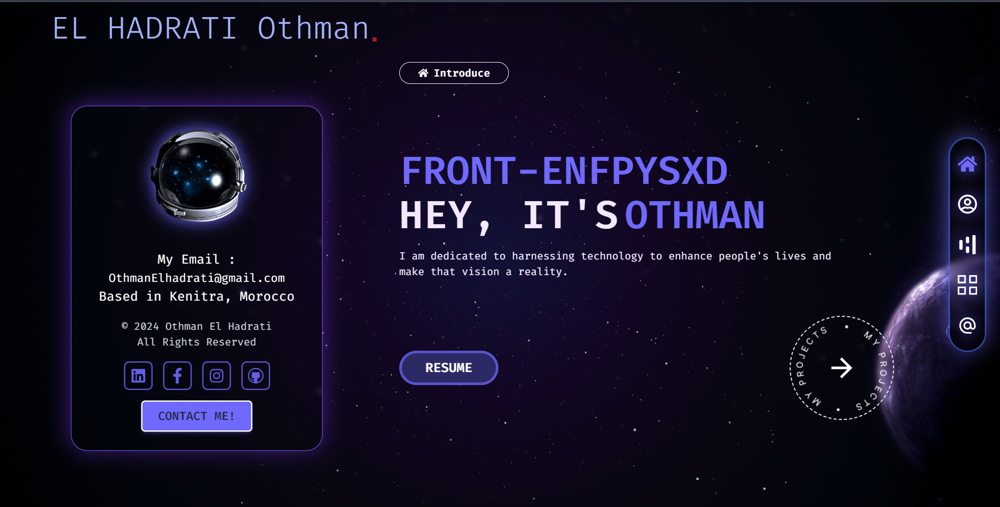

## **Portfolio**

Welcome to my portfolio ! This project showcases my work, skills, and experiences in data science, web development.



## **Table of Contents**

- [About the Project](#about-the-project)
- [Features](#features)
- [Technologies Used](#technologies-used)
- [Installation](#installation)
- [Contact](#contact)

## **About the Project**

This portfolio website is a single-page application (SPA) designed to present my personal and professional achievements. The site is fully responsive and optimized for performance. It's structured to give a clean and modern look while providing visitors with easy navigation to explore my projects, skills, and more.

## **Features**

- **Responsive Design:** Optimized for desktop, tablet, and mobile devices.
- **Smooth Animations:** Beautiful animations using Framer Motion.
- **Project Showcase:** A showcase of my best projects, each accompanied by a related image.
- **Contact Form:** Integrated contact form with form validation. 
- **Resume Download:** Option to download my resume directly from the site.


## **Used Technologies**

- **React:** Front-end library for building the user interface.
- **Tailwind CSS:** Utility-first CSS framework for styling.
- **Framer Motion:** Library for creating animations.
- **React Router:** For navigation and routing within the application.
- **EmailJS:** For handling the contact form submissions.
- **Vite:** Build tool for fast development and optimized production.

## **Installation**

To get a local copy up and running, follow these simple steps:

1. **Clone the repository:**
   ```bash
   https://github.com/ELhadratiOth/My-PortFolio.git
   ```

2. **Navigate to the project directory:**
   ```bash
   cd My-PortFolio
   ```

3. **Install dependencies:**
   ```bash
   npm install
   ```

4. **Start the development server:**
   ```bash
   npm run dev
   ```

5. Open your browser and go to `http://localhost:5173` to view the project.


## **Contact**
- **Email:** [othmanelhadrati@gmail.com](mailto:othmanelhadrari@gmail.com)
- **LinkedIn:** [Your LinkedIn Profile](https://www.linkedin.com/in/othman-el-hadrati-91aa98243)
